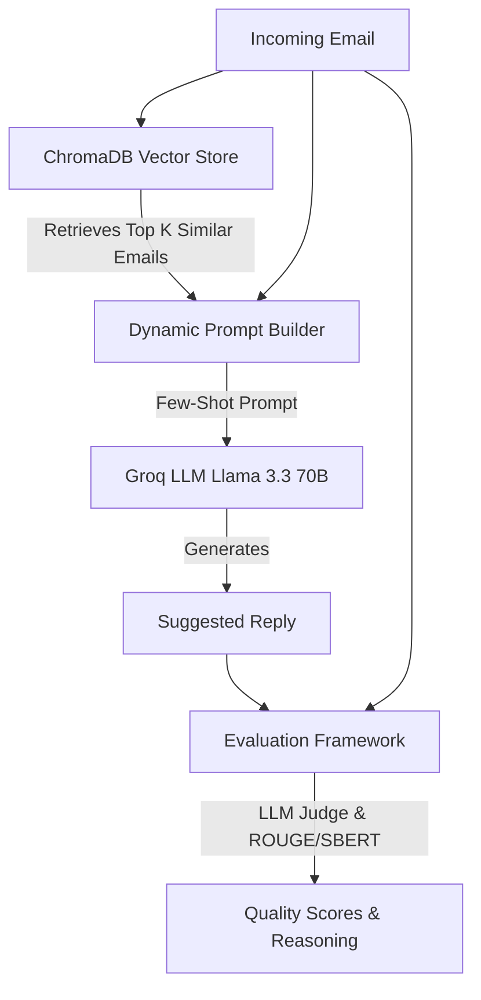

# ✉️ AI Email Suggested-Response System

**🔥 Live Demo:** [https://hiver-challenge.streamlit.app/](https://hiver-challenge.streamlit.app/)

An intelligent, production-ready system that generates contextual email replies grounded in historical corporate data (Enron corpus), featuring a multi-dimensional LLM-as-a-judge accuracy measurement framework.

---

## 🏗️ Architecture & Approach (HLD)



This system consists of three main components:

### 1. Data Ingestion & Retrieval (Vector DB)
We use a **Retrieval-Augmented Generation (RAG)** approach using **ChromaDB** and `sentence-transformers`.
* **Chunking Strategy:** Unlike long documents where recursive character chunking is needed, the atomic unit of context here is a *single email interaction*. We apply **Email-Level Chunking**, indexing the entire incoming email text as a single document, while storing the corresponding human reply and metadata (like Date/Subject) in the vector DB metadata payload. This guarantees perfect context boundaries without splitting sentences.
* **Why RAG instead of Fine-Tuning?** 
  Fine-tuning an LLM requires significant compute, locks you into a specific dataset, and is prone to catastrophic forgetting. By embedding the incoming emails from the Enron dataset, we can instantly retrieve $K$ similar historical situations and their corresponding replies to provide few-shot examples to a base model. This approach is highly modular (you can swap out the VectorDB for a customer service dataset instantly) and much cheaper to run.

### 2. Generative Response (Groq LLM)
When a new email arrives, we query ChromaDB for the top 3 similar emails, construct a prompt containing those examples, and send it to **Groq** (`llama-3.3-70b-versatile`). 
* **Prompt Engineering Technique:** We utilize **Dynamic Few-Shot Prompting**. The retrieved past emails are injected directly into the prompt as examples. We also strictly separate the `system` and `user` roles—the system prompt handles persona ("expert executive assistant") and formatting rules, while the user prompt only contains the newly arrived email data. This prevents prompt injection and hallucinations.
* **Why Groq?** Millisecond latency is critical for UI applications. Groq's LPU architecture provides instant generation.
* **Why Llama 3.3 70B?** 70B parameters provide excellent instruction following and tone replication without the immense cost of proprietary models like GPT-4.

### 3. Accuracy Measurement (The Core Challenge)
**The Problem with Standard Metrics:** Traditional Natural Language Processing accuracy metrics (like Exact Match, BLEU, or even ROUGE) are fundamentally flawed for generative conversational tasks. They measure *lexical overlap* (exact words used). If a user asks "Can we meet at 4?", both "Sure, 4pm works" and "Yes, see you at 16:00" are 100% accurate, yet an exact match score would be 0%.

**Why we use LLM-as-a-Judge (The Solution):** We implemented a hybrid metric approach heavily relying on an **LLM-as-a-Judge** framework. We pass the generated reply and the original email to a heavily prompted evaluator LLM that returns strict JSON across three dimensions:
1. **Relevance (1-10):** Does the reply actually answer the email? (Semantic Answer Relevance)
2. **Fluency (1-10):** Is it grammatically correct and natural?
3. **Tone (1-10):** Does it match a corporate setting?

*Trade-off:* While an LLM judge is slightly slower and more expensive than calculating a BLEU score locally, it actually reflects human-perceived quality. Crucially, it provides **deterministic reasoning** (the "why") for its score, allowing engineers to debug prompt failures. As a fallback/sanity check, the codebase also supports deterministic metrics like Semantic Similarity (SBERT) and ROUGE-L.

---

## 🚀 How to Run

### Prerequisites
1. Ensure Python 3.9+ is installed.
2. Ensure you have your `GROQ_API_KEY` added to the `.env` file in this directory.
3. The dataset `EnronEmailReplyPairsWithContext.csv` must be located at `../../challenge/data/` relative to this folder.

### Step 1: Install Dependencies
```bash
pip install -r requirements.txt
```

### Step 2: Initialize the Database
Run the ingestion script to create the local ChromaDB vector store. This will parse the CSV and embed a subset of emails for fast retrieval.
```bash
python data_prep.py
```

### Step 3: Start the Application
Launch the Streamlit interface to interact with the Generator and Evaluator.
```bash
streamlit run app.py
```

---

## 🧪 Example to Try

Once you have the app running (or on the Live Demo), try pasting this email into the generator to see how the RAG and Evaluator work together:

**Incoming Email:**
> Hi team,  
> I have a strict conflict tomorrow at 3 PM. Can we please reschedule our sync to either tomorrow morning at 10 AM, or push it to Thursday?  
> Thanks,  
> John

**Expected Ground-Truth Reply (Optional):**
> No problem John, let's push it to Thursday.

Hit **Generate Reply**, and once it finishes, hit **Run Evaluation** to see the exact reasoning the LLM Judge provides for grading the semantic relevance of the generated response! *(Notice that because you provided a Ground-Truth reply, the system will also calculate **SBERT Semantic Similarity** and **ROUGE-L**. If you left it blank, those metrics would display N/A).*

---

## 🧠 Trade-offs & Future Improvements
1. **Local vs Cloud DB:** We used a local ChromaDB instance to make this repository self-contained and easy to review for the hiring challenge. In production, this would be swapped for Pinecone, Weaviate, or a managed Chroma cloud instance.
2. **Evaluation Bottlenecks:** Currently, evaluation happens synchronously on a per-response basis. For a production evaluation pipeline (evaluating 10,000 generated emails offline), we would implement async batching for the Groq API calls to maximize throughput.
3. **Embedding Model:** We used `all-MiniLM-L6-v2`. It's incredibly fast on CPU, but larger models (like OpenAI's `text-embedding-3-large`) would yield higher quality semantic retrieval.
